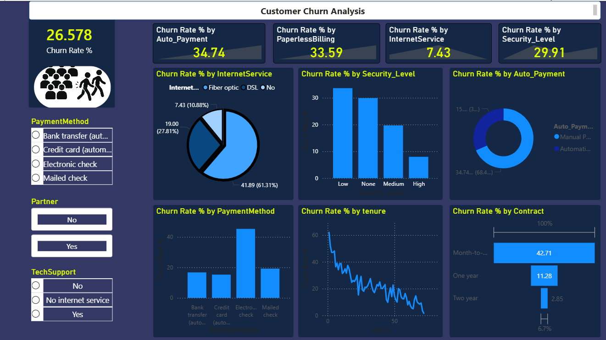

# 📡 Telco Customer Churn Analysis

> **End-to-end data analysis project** uncovering why telecom customers leave — and what the business can do about it.
> Built with Python, Pandas, and Power BI. Insights derived from 7,043 real customer records.

---

## 📊 Dashboard Preview



---

## 🎯 Business Problem

A telecom company is losing **26.6% of its customers** every year. Every churned customer is lost revenue — and acquiring a new customer costs 5–7x more than retaining an existing one.

**Goal:** Identify *who* is churning, *why* they are churning, and *what* the business can do to stop it.

---

## 💡 Key Insights — The Gold

These are the findings that a real business can act on immediately:

### 1. 📄 Contract Type is the #1 Churn Driver
| Contract | Churn Rate |
|----------|-----------|
| Month-to-month | **42.71%** |
| One year | 11.28% |
| Two year | 2.85% |

> **Recommendation:** Aggressively push customers toward annual contracts through discounts or loyalty perks. A customer on a 2-year contract is **15x less likely to churn** than a month-to-month customer.

---

### 2. 🌐 Fiber Optic Customers Are Leaving at Alarming Rates
| Internet Service | Churn Rate |
|-----------------|-----------|
| Fiber optic | **41.89%** |
| DSL | 19.00% |
| No internet | 7.43% |

> **Recommendation:** Fiber optic customers pay the most but churn the most — a major red flag. Investigate service quality, pricing, and competitor offerings for fiber customers specifically. This segment is the highest value and highest risk.

---

### 3. 💳 Automatic Payment = 2x Better Retention
| Payment Type | Churn Rate |
|-------------|-----------|
| Manual payment | **34.74%** |
| Automatic payment | 15.97% |

> **Recommendation:** Incentivize automatic payment enrollment — a discount, bonus data, or loyalty points. It costs almost nothing but cuts churn in half. This is the easiest quick win in this entire analysis.

---

### 4. 🔒 Security Features Are Retention Tools, Not Just Add-ons
| Security Level | Churn Rate |
|---------------|-----------|
| None | ~30% |
| Low (1 service) | ~32% |
| Medium (2 services) | ~21% |
| High (all 3 services) | ~8% |

> **Recommendation:** Customers with Online Security, Online Backup, and Device Protection churn 4x less. Bundle these services or offer a free trial — they create stickiness.

---

### 5. ⏳ The First 24 Months Are Critical
Churn rate starts at **~60% for new customers** and drops dramatically after month 24, stabilizing below 10% for customers past month 48.

> **Recommendation:** Focus retention efforts on customers in their first 2 years. Onboarding programs, check-in calls, and loyalty rewards in months 6, 12, and 24 could significantly reduce early churn.

---

### 6. 🧾 Paperless Billing Correlates With Higher Churn
| Paperless Billing | Churn Rate |
|------------------|-----------|
| Yes | **33.59%** |
| No | ~16% |

> **Recommendation:** Paperless billing customers may be more digitally engaged and comparison-shopping more actively. Target this segment with retention offers proactively.

---

### 7. 👥 Single Customers Churn More
| Has Partner | Churn Rate |
|------------|-----------|
| No | **33%** |
| Yes | 20% |

> **Recommendation:** Consider family/partner plans with shared benefits — they create shared switching costs and reduce individual churn risk.

---

## 🛠️ Project Structure

```
telco-churn-analysis/
│
├── data/
│   ├── Telco_Churn_Dataset.csv          ← Raw data
│   └── Cleaned_Telco_Churn_Dataset.csv  ← Cleaned (output of notebook)
│
├── notebooks/
│   └── main.ipynb                       ← Cleaning, EDA & feature engineering
│
├── dashboard/
│   └── Customer_Churn_Analysis.pbix     ← Power BI dashboard
│
├── assets/
│   └── dashboard.png                    ← Dashboard screenshot
│
└── README.md
```

---

## 🔧 What Was Done in Python

**Data Cleaning:**
- Converted `TotalCharges` from object to numeric (had 11 hidden blank strings)
- Dropped 11 rows with missing `TotalCharges` (0.15% of data — safe to drop)
- Dropped `customerID` (not analytically useful)

**Feature Engineering:**
- `Security_Score` — sum of OnlineSecurity + OnlineBackup + DeviceProtection (0–3 scale)
- `Auto_Payment` — binary flag extracted from PaymentMethod (contains "automatic")
- `avg_monthly_spend` — TotalCharges / tenure (normalized spend proxy)
- `num_services` — count of active services per customer

**Key Design Decision:** Original columns were never mutated — all derived features created as new columns. This kept the data clean for Power BI analysis while engineering useful signals.

---

## 📈 What Was Done in Power BI

- Connected directly to `Cleaned_Telco_Churn_Dataset.csv`
- Created DAX measure for Churn Rate %:
```
Churn Rate % = DIVIDE(COUNTROWS(FILTER(customers, customers[Churn] = "Yes")), COUNTROWS(customers)) * 100
```
- Built interactive dashboard with slicers for PaymentMethod, Partner, and TechSupport
- Visualized all 7 key insights above

---

## 🗂️ Dataset

**IBM Telco Customer Churn Dataset**
- 7,043 customers, 21 features
- Overall churn rate: **26.6%**
- Source: [Kaggle](https://www.kaggle.com/datasets/blastchar/telco-customer-churn)

---

## 🧰 Tech Stack

| Tool | Purpose |
|------|---------|
| Python 3.11 | Data cleaning & feature engineering |
| Pandas | Data manipulation |
| Power BI | Interactive dashboard & DAX measures |
| ydata-profiling | Automated EDA report |

---

## 🚀 How to Run

```bash
# 1. Clone the repo
git clone https://github.com/YOUR_USERNAME/telco-churn-analysis

# 2. Install dependencies
pip install pandas numpy matplotlib seaborn ydata-profiling

# 3. Run the notebook
jupyter notebook notebooks/main.ipynb

# 4. Open the dashboard
# Open dashboard/Customer_Churn_Analysis.pbix in Power BI Desktop
```

---

## 📬 Contact

Built by Aliyar Bayramov